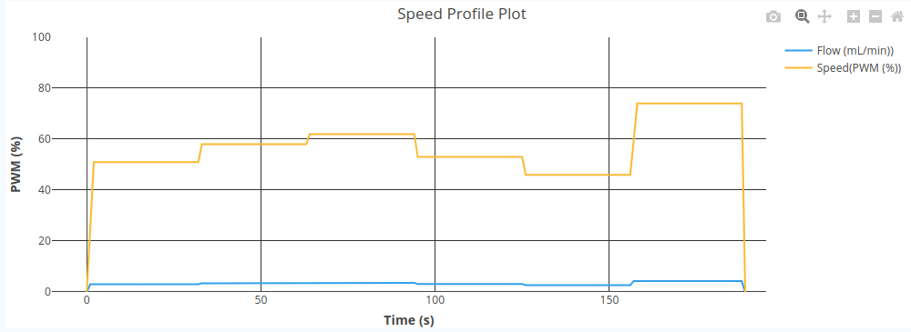

# Flow Speed Calibaration
The Flow Speed Calibration screen allows for calibration of the motor.
The workflow consits of **9** steps:
1. Set `Low PWM` in %.
2. Set `High PWM` in %.
3. Set `Time` in seconds.
4. Press the `Start` button and then press OK to start the calibration process.
5. Once the `Low PWM` calibration has finished measure the volume of the liquid and enter it into the corresponding box.
6. Press the `Continue` button and confirm with OK.
7. Once the `High PWM` calibration has finished measure the volume of the liquid and enter it into the `High PWM` box.
8. Enter the `Filename`.
9. Save the calibration with a confirmation on the `Save` button.

# Single Flow Speed
This screen is used to manually set the Flow. This is done by first loading or uploading a calibration file. If you want to upload a calibration file from your computer press the `Browse` button and select one.

Below is a sample calibration file.
```json
{
    "low_pwm": 10,
    "high_pwm": 100,
    "low_pwm_vol": 1.255,
    "high_pwm_vol": 6.46,
    "duration": 10
}
```

After the calibration file has been set you will see the calculated `Slope` in `mL/revolution`. Then you can set the `Flow` in `mL/min` and the desired `Acceleration` in `pwm/sec`. The default value is 100, which means the motor will accelerate from stand-still to full speed in a second. Set the desired `Direction` using the dropdown.

# Speed Profile
Aditionally to the calibration, this screen allows to select or upload a predefined `speed profile`. After the speed profile has been selected you will see a plot of it to the right, below the real time plot of the data.

The `speed profile` consists of several json objects, seperated with commas. The settings you can adjust are the `flow`, `duration` and `pwm_per_second`.

The `flow` field is set in `mL/min`, the `duration` field specifies for how long the set `flow` will be executed, and the `pwm_per_second` specifies the `acceleration` of the motor in `pwm/sec`.

```json
{
    "profile": [
        {"flow": 3.0, "duration": 30, "pwm_per_second": 50},
        {"flow": 3.4, "duration": 30, "pwm_per_second": 70},
        {"flow": 3.6, "duration": 30, "pwm_per_second": 100},
        {"flow": 3.1, "duration": 30, "pwm_per_second": 25},
        {"flow": 2.7, "duration": 30, "pwm_per_second": 50},
        {"flow": 4.3, "duration": 30, "pwm_per_second": 15}
    ]
}
```
The above speed profile will produce the following PWM profile with the `nejc1.json` calibration file.



After the `calibration` and `speed profile` files have been selected you can set the `Repeat` box to more repetitions if so desired.

# PoStep Config
The PoStep Config screen allows you to modify the PoStep60-256 motor driver current settings.
You can set the:
* Full-scale current (A)
* Idle current (A)
* Overheat current (A)